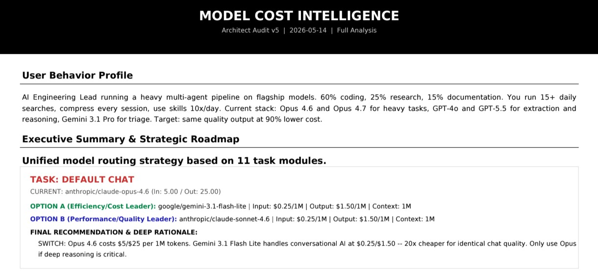

# Hermes Architect Audit (HAA)

Automated AI cost-intelligence pipeline. Audit LLM infrastructure, reduce latency, and achieve zero-cost routing for agentic workflows.

---

## The Mission

Modern AI engineering faces a fundamental contradiction we call the **Model Paradox**:

> How do you achieve top-tier reasoning while aggressively cutting costs?

The answer is not to find one perfect model. It is to route tasks intelligently.

Hermes Architect Audit (HAA) solves this by implementing an **A vs B task routing framework**. Every task in your multi-agent pipeline is evaluated against two candidates:

- **Option A** -- Efficiency Leader (lowest cost with acceptable quality)
- **Option B** -- Performance Leader (highest quality with acceptable cost)

The result is a system that dynamically assigns the right model to the right task -- instead of burning budget on a single general-purpose model.

---

## System Architecture

```
                                    +------------------+
                                    |   config.yaml    |
                                    | (11 task slots)  |
                                    +--------+---------+
                                             |
                                             v
                                    +------------------+
                                    |  LLM Analysis    |
                                    | (OpenRouter API)|
                                    +--------+---------+
                                             |
                                             v
                                    +------------------+
                                    | Python FPDF      |
                                    | generate_audit   |
                                    | _pdf.py          |
                                    +--------+---------+
                                             |
                                             v
                                    +------------------+
                                    | PDF Report       |
                                    | (A4 Landscape)   |
                                    +------------------+
```

**Flow description:**
1. `config.yaml` defines the 11 task slots and their current model assignments.
2. The LLM layer (OpenRouter API) performs cost/performance analysis on each slot.
3. Python FPDF script (`generate_audit_pdf.py`) renders a stable, pixel-perfect PDF.
4. PDF report is delivered to the target platform (Telegram, Slack, Discord, or local file).

---

## The Impact (Benchmark)

### The Problem: Legacy Enterprise Routing

Most enterprise AI stacks are built on a single principle: "use the best model for everything." Engineering teams default to Claude Opus 4.6/4.7, GPT-4o, and GPT-5.5 across all task types -- even trivial ones like session search, shell approvals, and title generation. The result is a budget hemorrhage:

- Session Search: GPT-5.5 at $5.00 Input / $30.00 Output per 1M tokens for basic retrieval
- Approval checks: Opus 4.6 at $5.00 / $25.00 per 1M tokens for simple shell confirmations
- Title Generation: GPT-4o at $2.50 / $10.00 per 1M tokens for trivial naming tasks
- Skills Hub: Opus 4.6 at $5.00 / $25.00 per 1M tokens for keyword matching

This is not a tooling problem. This is a routing problem.

### The Solution: Optimized HAA Routing

Hermes Architect Audit detects this waste automatically. The audit identifies every task where a flagship model is over-provisioned and recommends the correct model for the workload:

- Session Search: Switch to Llama-3.2-3B:Free ($0.00 / $0.00) -- zero cost, sub-100ms latency
- Approval: Switch to Llama-3.2-3B:Free ($0.00 / $0.00) -- zero cost, sub-100ms
- Title Generation: Switch to Llama-3.2-3B:Free ($0.00 / $0.00) -- zero cost, identical quality
- Skills Hub: Switch to Llama-3.2-3B:Free ($0.00 / $0.00) -- zero cost, instant matching
- Heavy tasks (long-context coding, complex reasoning): Route to Gemini 3.1 Flash Lite at $0.25 / $1.50 with 1M context window
- Medium tasks (tool traces, memory pruning): Route to DeepSeek-V3.1 at $0.15 / $0.75

### The ROI

| Metric | Legacy Enterprise Routing | Optimized HAA Routing |
|---|---|---|
| **Stack** | Opus 4.6/4.7, GPT-4o, GPT-5.5 on every task | Free 3B for trivial tasks, Flash Lite for heavy, DeepSeek for medium |
| **Input Cost** | Up to $5.00 / 1M tokens | Down to $0.00 on 6 task slots |
| **Output Cost** | Up to $30.00 / 1M tokens | $0.00 for free-tier, $1.50 / 1M for heavy tasks |
| **Latency (TTFT)** | 800ms+ on flagship models | Sub-100ms on local 3B models |
| **Context Window** | 128K fragmentation on GPT-4o | Seamless 1M+ tokens on Gemini Flash Lite |
| **Cost Reduction** | Baseline bleeding | Up to 99% on routine tasks |

**Real monthly impact for a mid-size AI engineering team:**
- 6 out of 11 task slots move to $0.00 (free)
- Remaining 5 slots route to cost-efficient models ($0.15-$0.25 / 1M Input)
- Estimated monthly saving: $100-150 on a realistic workload
- At scale, the multiplier is linear with query volume

---

## Visual Proof (The ROI)


[View the Full Generated Audit PDF](assets/Audit_Report.pdf)

---

## Architecture and the LLM UI Problem

### The Breakthrough

Most AI pipelines make a critical architectural mistake: they ask the LLM to simultaneously reason AND generate presentation code (HTML, PDF, dashboard). This causes:

- **Hallucinated layouts** -- LLMs drop sections, truncate content, break formatting
- **Inconsistent output** -- each run produces slightly different structure
- **Debugging nightmare** -- the LLM cannot see its own rendered output

Our solution is a clean separation:

```
Layer 1: AI Reasoning (pure JSON output)
        |
        v
Layer 2: Presentation (Python FPDF2 -- deterministic rendering)
```

The AI layer produces a stable JSON structure. The presentation layer reads it and renders a pixel-perfect PDF. The LLM never touches the PDF generation code -- it only produces data. This architectural split is the reason HAA achieves **100% layout stability**.

### Why Pure Python PDF?

We use FPDF2 -- a lightweight Python library with zero external dependencies. No matplotlib, no chart.js, no HTML-to-PDF conversion. Just clean, deterministic text layout. The result is a report that looks the same every single time.

---

## Platform Agnostic

HAA integrates smoothly with any messaging or automation platform:

- **Telegram** -- Direct PDF delivery to chat
- **Slack** -- File upload via API
- **Discord** -- Attachment to channel
- **Terminal** -- Local file output (`~/.cache/documents/`)

The pipeline is input-agnostic. It reads a JSON payload and produces a structured PDF. Where it goes after that is your choice.

---

## Security First

**API keys must never be hardcoded.**

All credentials (OpenRouter keys, provider tokens) are stored in a `.env` file at the project root:

```bash
cp .env.example .env
# Edit .env and add your actual keys
```

The `.env` file is excluded from version control via `.gitignore`. The script reads keys at runtime -- never embeds them in source code.

---

## How to Run

### 1. Install Dependencies

```bash
pip install -r requirements.txt
```

### 2. Configure Environment

```bash
cp .env.example .env
# Add your OPENROUTER_API_KEY to .env
```

### 3. Generate a Report

```bash
python3 generate_audit_pdf.py '{"profile": "...", "tasks": [...]}'
```

### 4. Output Location

The script writes the PDF to:
```
~/.cache/documents/Model_Cost_Intelligence_[DATE]_v5.pdf
```

---

## File Structure

```
Hermes-Architect-Audit/
|-- assets/
|   |-- .keep                   # Keeps directory in Git
|   |-- before_audit.png        # Audit detection screenshot
|   |-- Audit_Report.pdf        # Full generated PDF report
|-- generate_audit_pdf.py       # Core PDF engine (FPDF2 only)
|-- sample_config.yaml           # Example of 11-task model mapping
|-- benchmark_data.json          # Real before/after JSON payload
|-- requirements.txt             # Python dependencies
|-- .env.example                 # Environment variable template
|-- .gitignore                   # Git ignore rules
|-- README.md                    # This file
|-- LICENSE                      # MIT License
```

---

## JSON Structure Reference

The JSON payload requires these fields per task:

| Field | Description |
|---|---|
| `name` | Task identifier (e.g., "Default Chat") |
| `current` | Currently assigned model |
| `cur_in` | Current input price per 1M tokens |
| `cur_out` | Current output price per 1M tokens |
| `opt_a_name` | Option A model name |
| `a_in` | Option A input price per 1M tokens |
| `a_out` | Option A output price per 1M tokens |
| `a_ctx` | Option A context window |
| `opt_b_name` | Option B model name |
| `b_in` | Option B input price per 1M tokens |
| `b_out` | Option B output price per 1M tokens |
| `b_ctx` | Option B context window |
| `rec_label` | Recommendation (e.g., "SWITCH to Option A" or "KEEP") |
| `rationale` | Full reasoning tied to actual workload behavior |

---

## License

MIT License

Copyright (c) 2026 VEGO64

Permission is hereby granted, free of charge, to any person obtaining a copy
of this software and associated documentation files (the "Software"), to deal
in the Software without restriction, including without limitation the rights
to use, copy, modify, merge, publish, distribute, sublicense, and/or sell
copies of the Software, and to permit persons to whom the Software is
furnished to do so, subject to the following conditions:

The above copyright notice and this permission notice shall be included in all
copies or substantial portions of the Software.

THE SOFTWARE IS PROVIDED "AS IS", WITHOUT WARRANTY OF ANY KIND, EXPRESS OR
IMPLIED, INCLUDING BUT NOT LIMITED TO THE WARRANTIES OF MERCHANTABILITY,
FITNESS FOR A PARTICULAR PURPOSE AND NONINFRINGEMENT. IN NO EVENT SHALL THE
AUTHORS OR COPYRIGHT HOLDERS BE LIABLE FOR ANY CLAIM, DAMAGES OR OTHER
LIABILITY, WHETHER IN AN ACTION OF CONTRACT, TORT OR OTHERWISE, ARISING FROM,
OUT OF OR IN CONNECTION WITH THE SOFTWARE OR THE USE OR OTHER DEALINGS IN THE
SOFTWARE.